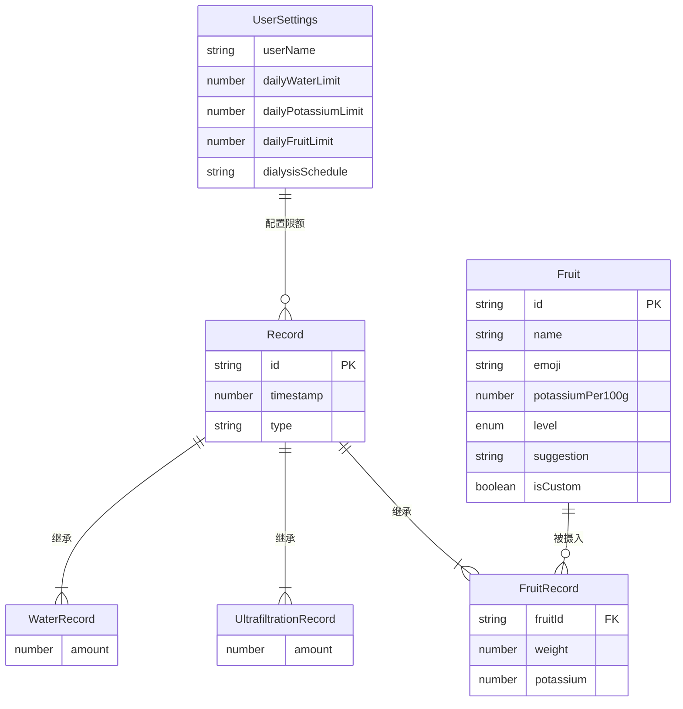

## 1. 架构设计

```mermaid
flowchart TD
    subgraph "前端层 Frontend"
        "A[React 应用]" --> "B[路由系统]"
        "B" --> "C[今日仪表盘]"
        "B" --> "D[记录中心]"
        "B" --> "E[水果钾含量库]"
    end
    subgraph "数据层 Data Layer"
        "C" --> "F[RecordStore]"
        "D" --> "F"
        "E" --> "G[FruitStore]"
        "C" --> "G"
    end
    subgraph "持久化层 Persistence"
        "F" --> "H[localStorage]"
        "G" --> "H"
        "I[SettingsStore]" --> "H"
        "C" --> "I"
    end
```

## 2. 技术说明

- **前端框架**：React@18 + TypeScript
- **构建工具**：Vite@5
- **样式方案**：TailwindCSS@3 + CSS Variables 用于主题色管理
- **图表库**：Recharts@2（基于 React 的声明式图表，适合数据可视化）
- **图标库**：lucide-react@0.4（线性图标，符合治愈系风格）
- **动画**：Framer Motion@11（页面过渡、卡片动画、进度条过渡）
- **路由**：React Router@6
- **状态管理**：Zustand@4（轻量级状态管理，配合 localStorage 持久化中间件）
- **数据持久化**：浏览器 localStorage（隐私优先，无需后端服务）
- **后端**：无（完全离线运行，注重患者隐私）
- **数据库**：无（使用 localStorage 存储结构化数据，含 JSON 序列化）

## 3. 路由定义

| 路由 | 用途 |
|-------|---------|
| / | 今日仪表盘，显示当日指标与快速记录 |
| /records | 记录中心，历史趋势与详情列表 |
| /fruits | 水果钾含量库，搜索与自定义添加 |
| /settings | 设置页，配置每日限额与个人参数 |

## 4. API 定义

无后端 API。所有数据通过 Zustand store + localStorage 中间件实现读写。

### 4.1 Store 接口定义

```typescript
// 记录类型
type RecordType = 'water' | 'ultrafiltration' | 'fruit';

interface BaseRecord {
  id: string;
  timestamp: number; // 记录时间戳
  type: RecordType;
}

interface WaterRecord extends BaseRecord {
  type: 'water';
  amount: number; // 毫升
}

interface UltrafiltrationRecord extends BaseRecord {
  type: 'ultrafiltration';
  amount: number; // 毫升
}

interface FruitRecord extends BaseRecord {
  type: 'fruit';
  fruitId: string;
  weight: number; // 克
  potassium: number; // 自动计算所得的钾摄入量 mg
}

type AnyRecord = WaterRecord | UltrafiltrationRecord | FruitRecord;

// 水果定义
interface Fruit {
  id: string;
  name: string;
  emoji: string;
  potassiumPer100g: number; // 每100g含钾量 mg
  level: 'low' | 'medium' | 'high'; // 钾含量等级
  suggestion: string; // 食用建议
  isCustom?: boolean;
}

// 用户设置
interface UserSettings {
  dailyWaterLimit: number; // 每日摄水限额 ml
  dailyPotassiumLimit: number; // 每日钾摄入限额 mg
  dailyFruitLimit: number; // 每日水果限额 g
  userName?: string;
  dialysisSchedule?: string; // 透析日程备注
}
```

## 5. 服务器架构图

不适用。本应用为纯前端应用，无服务器端。

## 6. 数据模型

### 6.1 数据模型定义



### 6.2 数据定义语言（localStorage 键值定义）

```typescript
// localStorage 键定义
const STORAGE_KEYS = {
  RECORDS: 'dialysis_records',        // AnyRecord[] 全部记录
  FRUITS: 'dialysis_fruits',          // Fruit[] 水果库
  SETTINGS: 'dialysis_settings',      // UserSettings 用户设置
  VERSION: 'dialysis_data_version',   // string 数据版本号，用于迁移
} as const;

// 内置水果初始数据 (部分示例)
const BUILTIN_FRUITS: Fruit[] = [
  { id: 'apple', name: '苹果', emoji: '🍎', potassiumPer100g: 119, level: 'low', suggestion: '可适量食用，建议每日不超过200g' },
  { id: 'pear', name: '梨', emoji: '🍐', potassiumPer100g: 119, level: 'low', suggestion: '可适量食用' },
  { id: 'banana', name: '香蕉', emoji: '🍌', potassiumPer100g: 256, level: 'high', suggestion: '高钾水果，透析患者慎食' },
  { id: 'orange', name: '橙子', emoji: '🍊', potassiumPer100g: 181, level: 'medium', suggestion: '中等钾含量，控制摄入' },
  { id: 'watermelon', name: '西瓜', emoji: '🍉', potassiumPer100g: 112, level: 'low', suggestion: '含水高，需计入摄水量' },
  { id: 'grape', name: '葡萄', emoji: '🍇', potassiumPer100g: 191, level: 'medium', suggestion: '中等钾含量' },
  { id: 'mango', name: '芒果', emoji: '🥭', potassiumPer100g: 168, level: 'medium', suggestion: '中等钾含量' },
  { id: 'peach', name: '桃子', emoji: '🍑', potassiumPer100g: 190, level: 'medium', suggestion: '中等钾含量' },
  { id: 'strawberry', name: '草莓', emoji: '🍓', potassiumPer100g: 153, level: 'medium', suggestion: '可适量食用' },
  { id: 'kiwi', name: '猕猴桃', emoji: '🥝', potassiumPer100g: 312, level: 'high', suggestion: '高钾水果，应避免' },
  { id: 'cherry', name: '樱桃', emoji: '🍒', potassiumPer100g: 222, level: 'medium', suggestion: '中等钾含量，控制摄入' },
  { id: 'pineapple', name: '菠萝', emoji: '🍍', potassiumPer100g: 113, level: 'low', suggestion: '可适量食用' },
];
```
